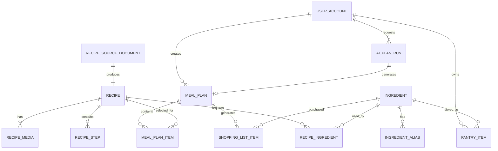

# FridgeClear 领域模型与数据库设计

## 1. 设计目标

FridgeClear 需要同时保存三类数据：

```text
HowToCook 原始菜谱数据
        ↓
标准化菜谱知识
        ↓
用户食材库存、AI 备餐计划和采购清单
```

设计原则：

1. 保留 HowToCook 原始 Markdown，方便追溯和重新导入。
2. 将可以查询和匹配的菜谱字段结构化。
3. 用户库存必须与菜谱食材建立关系。
4. AI 生成的计划需要保存，方便用户修改和复盘。
5. 不把烹饪步骤强行拆成过多字段，第一版保留完整文本。
6. 暂时不引入复杂营养模型、供应链、电商和多人协作。

## 2. MVP 领域范围

### 外部知识域

- `recipe_source_document`：HowToCook 原始 Markdown 文档
- `recipe`：菜谱基础信息
- `ingredient`：标准食材、调料或厨具
- `ingredient_alias`：食材别名
- `recipe_ingredient`：菜谱与食材的关系
- `recipe_step`：菜谱步骤
- `recipe_media`：菜谱图片

### 用户业务域

- `user_account`：用户
- `pantry_item`：用户当前拥有的食材
- `meal_plan`：一次 AI 生成的备餐计划
- `meal_plan_item`：计划中的每一顿饭
- `shopping_list_item`：缺少或建议采购的食材

### AI 运行域

- `ai_plan_run`：一次 AI 规划请求及其结果

## 3. 实体关系



## 4. 表和字段设计

数据库字段统一使用 `snake_case`，Java 属性使用 `camelCase`。

### 4.1 user_account

| 字段 | 类型 | 必填 | 说明 |
|---|---|---:|---|
| `id` | bigint | 是 | 主键 |
| `email` | varchar(128) | 否 | 登录邮箱，MVP 可暂不启用 |
| `nickname` | varchar(64) | 否 | 昵称 |
| `created_at` | datetime | 是 | 创建时间 |
| `updated_at` | datetime | 是 | 修改时间 |

MVP 可以先使用一个演示用户，但保留 `user_id`，避免后续重新改表。

### 4.2 recipe_source_document

保存外部 Markdown 原文，不参与用户业务查询。

| 字段 | 类型 | 必填 | 说明 |
|---|---|---:|---|
| `id` | bigint | 是 | 主键 |
| `source_repository` | varchar(255) | 是 | Git 仓库地址 |
| `source_commit` | varchar(64) | 是 | 导入时的 commit |
| `source_path` | varchar(512) | 是 | 相对仓库路径 |
| `file_hash` | varchar(64) | 是 | 文件内容哈希，用于增量导入 |
| `raw_markdown` | longtext | 是 | 原始 Markdown |
| `parser_version` | varchar(32) | 是 | 导入器版本 |
| `import_status` | varchar(32) | 是 | `SUCCESS` / `PARTIAL` / `FAILED` |
| `import_error` | text | 否 | 导入错误信息 |
| `imported_at` | datetime | 是 | 导入时间 |

约束：

```text
unique(source_repository, source_commit, source_path)
```

### 4.3 recipe

保存菜谱可查询的基础信息。

| 字段 | 类型 | 必填 | 说明 |
|---|---|---:|---|
| `id` | bigint | 是 | 主键 |
| `source_document_id` | bigint | 是 | 原始文档 ID |
| `name` | varchar(128) | 是 | 菜名 |
| `slug` | varchar(160) | 是 | URL 或前端路由标识 |
| `category` | varchar(32) | 是 | `AQUATIC`、`MEAT_DISH` 等 |
| `description` | text | 否 | 菜谱介绍 |
| `difficulty_text` | varchar(32) | 否 | 原始难度文本 |
| `difficulty_level` | tinyint | 否 | 1 到 5，能解析时保存 |
| `calories` | decimal(10,2) | 否 | 卡路里 |
| `source_title` | varchar(160) | 否 | 原始一级标题 |
| `status` | varchar(32) | 是 | `ACTIVE` / `HIDDEN` |
| `created_at` | datetime | 是 | 创建时间 |
| `updated_at` | datetime | 是 | 修改时间 |

约束：

```text
unique(source_document_id)
unique(slug)
```

### 4.4 ingredient

标准化食材、调料和厨具。第一版允许 `UNKNOWN`，不要强行猜错。

| 字段 | 类型 | 必填 | 说明 |
|---|---|---:|---|
| `id` | bigint | 是 | 主键 |
| `canonical_name` | varchar(128) | 是 | 标准名称 |
| `normalized_name` | varchar(128) | 是 | 用于匹配的名称 |
| `ingredient_type` | varchar(32) | 是 | `FOOD` / `SEASONING` / `TOOL` / `UNKNOWN` |
| `default_unit` | varchar(32) | 否 | 默认单位 |
| `created_at` | datetime | 是 | 创建时间 |
| `updated_at` | datetime | 是 | 修改时间 |

约束：

```text
unique(normalized_name)
```

### 4.5 ingredient_alias

| 字段 | 类型 | 必填 | 说明 |
|---|---|---:|---|
| `id` | bigint | 是 | 主键 |
| `ingredient_id` | bigint | 是 | 标准食材 ID |
| `alias_name` | varchar(128) | 是 | 别名 |
| `normalized_alias` | varchar(128) | 是 | 用于匹配的别名 |

约束：

```text
unique(normalized_alias)
```

### 4.6 recipe_ingredient

这是最重要的关联表，保存菜谱使用了什么食材以及原始用量。

| 字段 | 类型 | 必填 | 说明 |
|---|---|---:|---|
| `id` | bigint | 是 | 主键 |
| `recipe_id` | bigint | 是 | 菜谱 ID |
| `ingredient_id` | bigint | 否 | 解析成功时关联标准食材 |
| `raw_name` | varchar(255) | 是 | 原始食材名称 |
| `role` | varchar(32) | 是 | `MAIN` / `SEASONING` / `TOOL` / `UNKNOWN` |
| `is_optional` | boolean | 是 | 是否可选 |
| `raw_quantity` | varchar(255) | 否 | 原始用量文本 |
| `quantity_min` | decimal(12,3) | 否 | 可解析的最小值 |
| `quantity_max` | decimal(12,3) | 否 | 可解析的最大值 |
| `unit` | varchar(32) | 否 | 原始单位 |
| `quantity_parse_status` | varchar(32) | 是 | `PARSED` / `PARTIAL` / `UNPARSED` |
| `source_section` | varchar(32) | 是 | `REQUIRED` / `CALCULATION` / `OPERATION` |
| `sort_order` | int | 是 | 原始顺序 |

这里必须保留 `raw_name` 和 `raw_quantity`，不能只保存标准化结果。

### 4.7 recipe_step

| 字段 | 类型 | 必填 | 说明 |
|---|---|---:|---|
| `id` | bigint | 是 | 主键 |
| `recipe_id` | bigint | 是 | 菜谱 ID |
| `step_no` | int | 是 | 步骤序号 |
| `content` | text | 是 | 完整步骤文本 |

第一版不拆分时间、火候、温度和动作，避免误解析。

### 4.8 recipe_media

| 字段 | 类型 | 必填 | 说明 |
|---|---|---:|---|
| `id` | bigint | 是 | 主键 |
| `recipe_id` | bigint | 是 | 菜谱 ID |
| `media_type` | varchar(32) | 是 | `IMAGE` |
| `source_path` | varchar(512) | 是 | 原始相对路径 |
| `alt_text` | varchar(255) | 否 | 图片描述 |
| `sort_order` | int | 是 | 图片顺序 |

### 4.9 pantry_item

表示用户当前拥有的一份食材库存。

| 字段 | 类型 | 必填 | 说明 |
|---|---|---:|---|
| `id` | bigint | 是 | 主键 |
| `user_id` | bigint | 是 | 用户 ID |
| `ingredient_id` | bigint | 否 | 匹配到的标准食材 |
| `raw_name` | varchar(128) | 是 | 用户输入名称 |
| `quantity` | decimal(12,3) | 否 | 数量 |
| `unit` | varchar(32) | 否 | 单位 |
| `purchase_date` | date | 否 | 购买日期 |
| `expire_date` | date | 否 | 过期日期 |
| `status` | varchar(32) | 是 | `AVAILABLE` / `USED_UP` / `EXPIRED` / `DISCARDED` |
| `note` | varchar(255) | 否 | 备注 |
| `created_at` | datetime | 是 | 创建时间 |
| `updated_at` | datetime | 是 | 修改时间 |

### 4.10 meal_plan

表示一次 AI 生成的计划，而不是单独的一顿饭。

| 字段 | 类型 | 必填 | 说明 |
|---|---|---:|---|
| `id` | bigint | 是 | 主键 |
| `user_id` | bigint | 是 | 用户 ID |
| `ai_plan_run_id` | bigint | 否 | 生成来源 |
| `title` | varchar(128) | 是 | 计划标题 |
| `start_date` | date | 是 | 开始日期 |
| `end_date` | date | 是 | 结束日期 |
| `status` | varchar(32) | 是 | `DRAFT` / `ACTIVE` / `COMPLETED` / `ARCHIVED` |
| `constraints_json` | json | 否 | 人数、时间、忌口、厨具等约束 |
| `created_at` | datetime | 是 | 创建时间 |
| `updated_at` | datetime | 是 | 修改时间 |

### 4.11 meal_plan_item

| 字段 | 类型 | 必填 | 说明 |
|---|---|---:|---|
| `id` | bigint | 是 | 主键 |
| `meal_plan_id` | bigint | 是 | 计划 ID |
| `plan_date` | date | 是 | 用餐日期 |
| `meal_type` | varchar(32) | 是 | `BREAKFAST` / `LUNCH` / `DINNER` / `SNACK` |
| `recipe_id` | bigint | 是 | 菜谱 ID |
| `servings` | decimal(8,2) | 否 | 份数 |
| `reason` | text | 否 | AI 推荐理由 |
| `status` | varchar(32) | 是 | `PLANNED` / `COOKED` / `SKIPPED` |
| `sort_order` | int | 是 | 同一天内排序 |

### 4.12 shopping_list_item

| 字段 | 类型 | 必填 | 说明 |
|---|---|---:|---|
| `id` | bigint | 是 | 主键 |
| `meal_plan_id` | bigint | 是 | 来源计划 |
| `ingredient_id` | bigint | 否 | 标准食材 ID |
| `name` | varchar(128) | 是 | 采购名称 |
| `quantity` | decimal(12,3) | 否 | 建议采购数量 |
| `unit` | varchar(32) | 否 | 单位 |
| `reason` | varchar(255) | 否 | 缺少、补充或替代说明 |
| `status` | varchar(32) | 是 | `TODO` / `PURCHASED` / `SKIPPED` |

### 4.13 ai_plan_run

记录 AI 规划过程，便于调试和展示 AI Native 能力。

| 字段 | 类型 | 必填 | 说明 |
|---|---|---:|---|
| `id` | bigint | 是 | 主键 |
| `user_id` | bigint | 是 | 用户 ID |
| `model_name` | varchar(128) | 是 | 使用的模型 |
| `prompt_version` | varchar(32) | 是 | Prompt 版本 |
| `request_json` | json | 是 | AI 输入 |
| `response_json` | json | 否 | AI 原始输出 |
| `status` | varchar(32) | 是 | `RUNNING` / `SUCCESS` / `FAILED` |
| `error_message` | text | 否 | 错误信息 |
| `started_at` | datetime | 是 | 开始时间 |
| `finished_at` | datetime | 否 | 完成时间 |

## 5. 关键设计决定

### 原始数据和业务数据分开

```text
recipe_source_document.raw_markdown
    └── 外部知识原文

recipe / ingredient / recipe_ingredient
    └── 可查询和匹配的标准化数据

pantry_item / meal_plan / shopping_list_item
    └── FridgeClear 用户业务数据
```

### 暂不把 Markdown 每一行都拆成字段

步骤、附加内容和复杂用量保留原文。只有菜名、分类、食材关系、顺序等真正需要查询的内容才结构化。

### 暂不决定 pgvector

先使用结构化字段完成库存匹配和过滤。等菜谱数据导入后，再根据自然语言检索效果决定是否加入向量表或 pgvector。

### MVP 可以不实现登录

数据库保留 `user_id`，开发阶段创建一个演示用户即可。这样不影响后续接入 JWT。

## 6. 当前不纳入 MVP

- 营养目标和医疗饮食建议
- 食材价格和电商下单
- 多人家庭协作
- 智能冰箱设备连接
- 自动冰箱图片识别
- 复杂单位换算
- 自动识别火候、温度和烹饪动作
